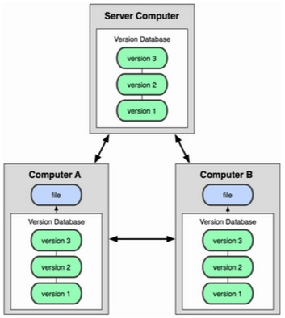

<h1>Sistema de Chat JoinChat</h1>
<h3>Equipo:</h3>
<ul>
	<li>Isabel Lozano.</li>
	<li>Felipe Calad.</li>
	<li>Joinner Ovalle.</li>
	<li>John Edgar Congote.</li>
	<li>Juan Diego Pérez Martínez.</li>
</ul>
<h3>Roles:</h3>
<ul>
	<li>Servicio Web: Php, html, JS.</li>
	<li>Comunicación: WebRTC, Python, JS.</li>
	<li>Almacenamiento: Mysql, Java.</li>
	<li>I+D(Documentación):  Login: Google, Facebook, Twitter, OpenID, BioID</li>
</ul>
<h3>Repositorio:</h3>

	Se está utilizando un repositorio Github, conectado a máquina virtual koding para alojar la aplicación. El 			nombre del proyecto es JoinChat. El link de la pag es: 
	<ahref="http://joinchat.kladfelipe.koding.io/">http://joinchat.kladfelipe.koding.io</a>

<h3>Git:</h3>

	Es un sistema de control de versiones, o sea un sistema que registra los cambios realizados sobre el tiempo 			sobre un archivo o un conjunto de estos, permitiendo recuperar versiones específicas más adelante.

Existen 2 tipos de VCS:

Centralizados:

Distribuidos:

Git es un VCS distribuido.

<h4> Funcionamiento de Git:</h4>

<h4>3 estados de Git:</h4>

Committed: Los datos están almacenados de manera segura en la base de datos local.

Modified: Hay modificaciones pero no están confirmadas en la base de datos.

Staged: Un archivo modificado esta marcado para ir en la próxima confirmación.

<h4>Secciones principales:</h4>

	El directorio de Git: Es la parte donde se almacenan los metadatos y la base de datos de objetos del proyecto. Es lo 	que se copia al clonar un repositorio desde otro ordenador.

	El directorio de trabajo: Es una copia de una versión del proyecto. Se saca de la base  de datos comprimida en el 		directorio Git y se coloca en el disco para uso y modificación.

	El área de preparación(índice): Es un archivo sencillo que contiene información a cerca de lo que va a ir en la 		próxima confirmación.

<h4>Flujo de trabajo:</h4>
<ol>
	<li>Se modifican los archivos en el directorio de trabajo.</li>
	<li>Se preparan los archivos añadiéndolos al área de confirmación.</li>
	<li>
		Se confirman los cambios(commit), lo que toma los archivos como están en el área de preparación y almacena 			esas instantáneas de manera permanente en el directorio.
	</li>
</ol>
<h4>Acciones importantes Git:</h4>

Fetch sirve para traer la última versión disponible en el servidor remoto.

Pull sirve para aplicarlos los cambios localmente.

Commit aplica los cambios que he realizado en el servidor local.

Push sirve para subir los cambios que he hecho al servidor remoto.

<h5>Los comandos para realizar estas acciones por consola son:</h5>
<ul>
	<li>git fetch</li>
	<li>git pull</li>
	<li>git push</li>
	<li>git commit -m "Commit message"</li>
</ul>

	Para facilitar el trabajo y poderlo hacer de una manera más ágil se va a utilizar una interfaz gráfica para Git, 		llamada Source tree.

Con Source tree podemos realizar tareas como:

<ul>
	<li>
		Crear y clonar repositorios de cualquier sitio, tanto Git como Mercurial. Además de integrarse perfectamente 		con Bitbucket o Github
	</li>
	<li>Commit, push, pull y merge de nuestros archivos</li>
	<li>Detectar y resolver conflictos.</li>
	<li>Consultar el historial de nuestros repositorios.</li>
</ul>
<h4>Crear un repositorio con Github y Sourcetree:</h4>
<ul>
	<li>Clic en Clone/new: </li>
	
	<li>Esto da la posibilidad de clonar, agregar y crear un nuevo repositorio.</li>
	<li>
		Para poder clonar un repositorio desde Github necesitamos copiar la url del repositorio. Es recomendable 			hacer fork del proyecto antes, lo que me permite trabajar sobre una copia del proyecto y no sobre el 				original 
	</li>
	
	<li>
		Ahora se copia esta URL en la ventana del Clone/new en el Sourcetree: 
	</li>
	
	<li>Finalmente se hace clic en Clone y el repositorio ya queda listo para trabajar.</li>
</ul>
<h3>Koding:</h3>

	Es un entorno de desarrollo virtual, que permite desarrollar en lenguajes de programación como python, java, perl, 		Node.js, Ruby, C, C++, php etc. sin necesidad de descargar los kits de desarrollo.

	Un concepto que se debe tener claro para trabajar en koding es “Koding Package Manager” que en español es el 			administrador de paquetes de Koding, que es una herramienta que facilita la gestión de paquetes en Koding.

	Para instalar KPM se utiliza el siguiente comando:

<i>curl -sSL "https://raw.githubusercontent.com/koding\ /kpm-scripts/master/installers/meta" | fish </i>

<h3>Tomcat</h3>

	Tomcat es un contenedor Web con soporte de servlets y JSPs. Puede ser utilizado como servidor web por si mismo. Para 	instalar Tomcat utilizamos los siguientes comandos:

<i> kpm install tomcat </i>

luego se descarga el paquete,

<i>wget mirrors.gigenet.com/apache/tomcat/tomcat-7/v7.0.57/bin/apache-tomcat-7.0.57.tar.gz</i>

Luego se descomprime el paquete descargado,

<i>tar -xvzf apache-tomcat-7*</i>

Para facilidad de acceso se renombra el directorio,

<i>mv apache-tomcat-7.0.57 tomcat</i>

	Ahora se necesita crear un usuario y contraseña, para lo cual se añade esta línea debajo de </tomcat-users>  en el 		archivo tomcat-users.xml que se encuentra en la carpeta config:

<i> &lt;user name="anyusername" password="anypassword" roles="admin-gui,manager-gui" &gt; </i>

	Finalmente para evitar conflictos con el puerto debemos cambiar el puerto que usará tomcat, y esto se modifica en el 	archivo server.xml:

y ahora ya podemos iniciar el tomcat en el servidor con el siguiente comando:

<i>bash tomcat/bin/startup.sh</i>

